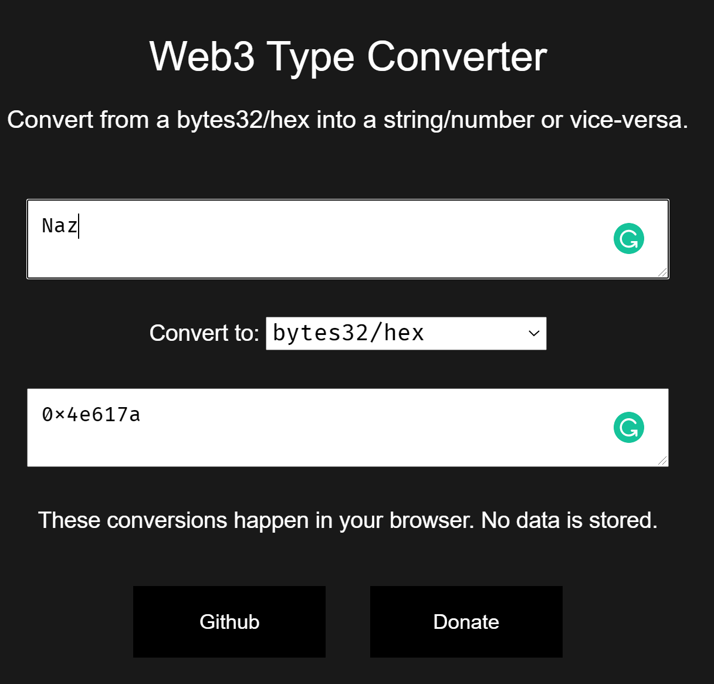
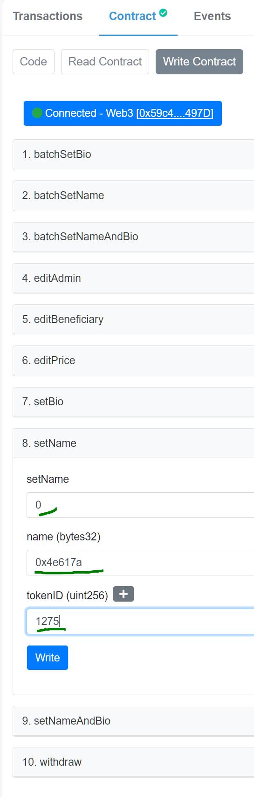

# kong-naming

Kontrakt that lets kong naming and setting bios

This is a set of directories responsible for setting the kongs' names and bio.

First set of name and bio is free. Having meta automatically update requires running costs. Handling metadata is error-prone, and so having subsequent name and bio sets being paid handles both of these issues. The cost of setting the bio / name may change in the future, if ether price surges, or due to other factors.

The RKL team reserves the right to override the names / bio if they are deemed offensive / inappropriate.

## Tech Overview

There are three directories `naming-contract`, `naming-subgraph`, as well as `naming-update-script`. Contract is responsible for setting the names on the blockchain. Subgraph will index all the historical names, so in that way each kong will have his naming and bio provenance. Finally, the update script runs on a server, pulls the name changes from the subgraph, compares to the IPFS meta, and uploads the new meta along with the old one. It also saves which meta it has changed. New base URI for the collection is set on the contract.

## How to change the name / bio with a contract on Etherscan

- go to [this website](https://web3-type-converter.onbrn.com/)

  

- type in the name of your kong, in the example above: Naz. Ensure that the dropdown says bytes32/hex
- copy the output
- go to [KongNaming contract](https://etherscan.io/address/0x02afD7FD5B1C190506F538B36e7741a2F33D715d#writeContract)



- expand the setName section.
- if this is the first time the kong's name is being set, input value 0 in the first field. It means you are not sending any ether along. If itsn't the first time you are setting the name, you will have to input 0.025 in that field.
- in the name field, paste the value you have copied in the earlier step (web3 type converter)
- finally specify the tokenID of the kong for which you wish to set the name

When it comes to setting the bios, follow the same procedure except for web3 type conversion. You can input plain text in bio.

There are also functions for batch operations to save you on gas. This avoids you having to specify the names for each of your kongs one by one. You can name and set bios for all the kongs in one transaction.

Note that it may be a bit pricey to set the name / bio on the first run, since we need to write extra information to the storage of the contract. i.e. that this was the first set. For that reason, I advise you to wait when the gas is sub 50 gwei to name / set bio on your kong.

Also note, that as soon as we get the UI / UX re-design of the website, we will get a fronter on this to make you setting the name and bio life easier.

---

For the tech people. You can simply encode the name in brownie console like so

```python
from brownie.convert import to_bytes

to_bytes("Naz".encode('utf-8'), 'bytes32').hex()
>>> 00000000000000000000000000000000000000000000000000000000004e617a
```

and to decode

```python
bytes.fromhex('00000000000000000000000000000000000000000000000000000000004e617a').decode('utf-8')
>>> \x00\x00\x00\x00\x00\x00\x00\x00\x00\x00\x00\x00\x00\x00\x00\x00\x00\x00\x00\x00\x00\x00\x00\x00\x00\x00\x00\x00\x00Naz
```

---

LFG 👑🦍
